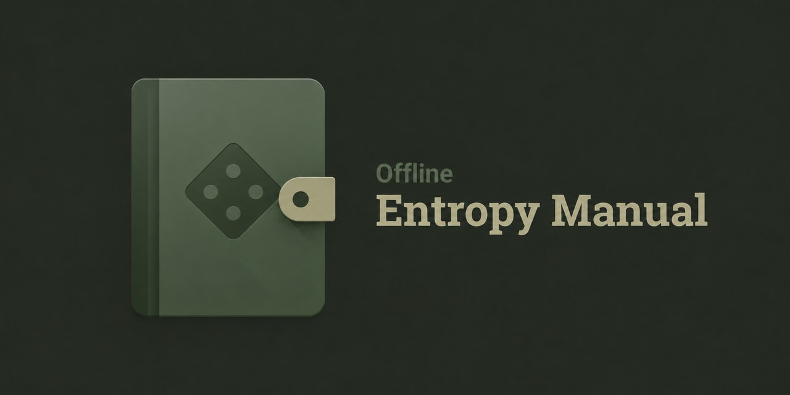

# Offline Entropy Manual



Android app that ships entropy / seed backup guides as offline PDFs. Pick what tools you have (dice, coins, cards, …) and open the matching docs.

The guides help you generate entropy offline. The last BIP39 word (12th or 24th) is a checksum: this app does not calculate it. Use a hardware wallet or another airgapped device you trust for that step. Never enter your seed into a website or a normal phone app.

Inspired by [SurvivalManual](https://github.com/ligi/SurvivalManual).

Versions follow [Semantic Versioning](https://semver.org/spec/v2.0.0.html). Notable changes are listed in [`CHANGELOG.md`](CHANGELOG.md) using [Keep a Changelog](https://keepachangelog.com/en/1.0.0/).

```bash
./gradlew :app:assembleDebug
```

## Release build

Signing uses a local upload keystore. Put these in gitignored `local.properties`:

```properties
OEM_STORE_FILE=/absolute/path/to/upload.jks
OEM_STORE_PASSWORD=…
OEM_KEY_ALIAS=upload
OEM_KEY_PASSWORD=…
```

Then:

```bash
./gradlew :app:assembleRelease
```

## Publishing to Zapstore

Config lives in [`zapstore.yaml`](zapstore.yaml) (includes publisher `pubkey`). Releases are published with [`zsp`](https://github.com/zapstore/zsp).

1. Install `zsp` from [zsp releases](https://github.com/zapstore/zsp/releases) (or `go install github.com/zapstore/zsp@latest`).
2. Cut a GitHub release that includes the signed APK (or build `assembleRelease` locally).
3. Publish with your Nostr key for `npub1dergggklka99wwrs92yz8wdjs952h2ux2ha2ed598ngwu9w7a6fsh9xzpc`:

```bash
./scripts/zapstore-publish.sh
```

`SIGN_WITH` is read from a gitignored `.env` in the repo root (`SIGN_WITH=nsec1…`, `bunker://…`, or `browser`). An already-exported `SIGN_WITH` wins over `.env`.

The script publishes through `zapstore.yaml` (not a bare APK path) so `release_notes` from [`CHANGELOG.md`](CHANGELOG.md) are included. Use `ZSP_EXTRA_ARGS='--overwrite-release'` to replace an already-published version.

First publish links the APK signing certificate to your Nostr identity (NIP-C1) and whitelists the repo via `zapstore.yaml`.

## License

**App code** is [MIT](LICENSE).

**Bundled guides** are not covered by the app MIT license. Known terms:

- BitBox Diceware materials: [CC BY-SA 4.0](https://creativecommons.org/licenses/by-sa/4.0/)
- Seed Picker Solitaire: [Apache-2.0](https://www.apache.org/licenses/LICENSE-2.0)
- BIP39 English word list (`bitcoin/bips`): [MIT](https://opensource.org/licenses/MIT)
- The Simplest Bitcoin Book workshop: [CC BY-NC](https://creativecommons.org/licenses/by-nc/4.0/) (site: non-commercial Creative Commons)
- The Bitcoin Hole and entropy.page materials: author's terms (no public license found)

Check each source linked from the About screen before redistributing the PDFs on their own.
